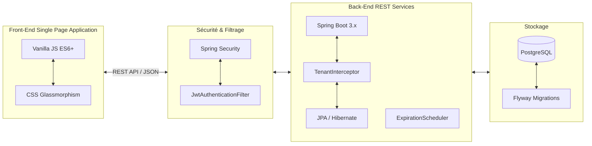
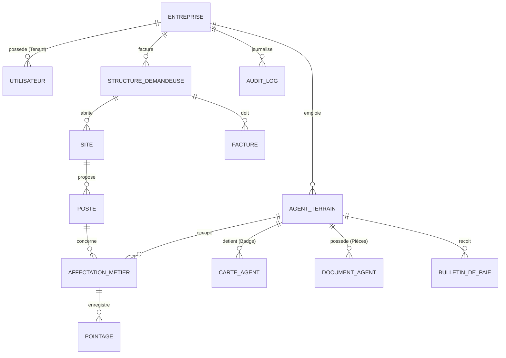

# CAHIER DES CHARGES FONCTIONNEL ET TECHNIQUE EXHAUSTIF (CdC)
## Projet : **SimpleTaff - Plateforme SaaS de Gestion du Personnel de Terrain & SIRH**
### *Document de Référence pour Soutenance de Mémoire de Fin d'Études*

---

## SOMMAIRE
1. **Introduction et Contexte du Projet**
   - 1.1 Problématique & Marché Cible
   - 1.2 Objectifs Stratégiques de SimpleTaff
2. **Matrice des Personas et Droits d'Accès (RBAC)**
   - 2.1 Les Rôles Utilisateurs
   - 2.2 Matrice de Droits RBAC
3. **Architecture Technique et Concept Multi-Tenant**
   - 3.1 Stack Technologique Standardisée
   - 3.2 Étanchéité Multi-Tenant & Isolation de Données
   - 3.3 Sécurisation Cryptographique des QR Codes (JWT/HMAC)
   - 3.4 Algorithme de Géorepérage (Geofencing GPS)
4. **Spécifications Fonctionnelles Détaillées par Module**
   - 4.1 Module 1 : Enrôlement Guidé en 4 Onglets (Modal 4-Tabs)
   - 4.2 Module 2 : Gestion Contractuelle & Pièces Jointes
   - 4.3 Module 3 : Affectations, Sites Clients & Missions
   - 4.4 Module 4 : Système de Pointage Hybride (4 Modes)
   - 4.5 Module 5 : Paie, Primes de Rendement & Cotisations Ivoiriennes (CNPS, CNAM)
   - 4.6 Module 6 : Facturation Client & Suivi de Règlements
   - 4.7 Module 7 : Dotation Matériel & Signature d'Émargement
   - 4.8 Module 8 : Congés & Workflow d'Absences Injustifiées
   - 4.9 Module 9 : Dossier Disciplinaire & Évaluations Annuelles
   - 4.10 Module 10 : Journal d'Audit & Rapports Exports
5. **Dictionnaire des Données et Schéma PostgreSQL**
   - 5.1 Diagramme Entité-Association (ERD)
   - 5.2 Schéma SQL de la Base de Données
6. **Spécification des Interfaces et Catalogue des API REST**
7. **Exigences Non Fonctionnelles (Qualité du Service)**
8. **Plan de Recette et Critères d'Acceptation**
9. **Guide de Soutenance : Questions Clés & Réponses du Jury**

---

## 1. INTRODUCTION ET CONTEXTE DU PROJET

### 1.1 Problématique & Marché Cible
Dans les secteurs d'activité employant des effectifs mobiles ou détachés sur le terrain (sécurité privée, nettoyage industriel, BTP, logistique, événementiel), le suivi opérationnel et administratif du personnel pose des défis quotidiens majeurs :
* **Fraude au pointage** : Les fiches de présence papier ou les déclarations verbales induisent des dérives financières (pointages de complaisance, usurpations d'identité).
* **Traitement manuel de la paie** : La collecte tardive des heures de présence provoque des retards de paie et des erreurs de calcul (heures supplémentaires erronées, oublis de retenues).
* **Faible traçabilité du matériel** : L'attribution des équipements de protection (EPI), des téléphones de fonction et des badges est rarement centralisée, entraînant des pertes d'actifs significatives.
* **Risques de non-conformité administrative** : Le suivi manuel de la validité des pièces justificatives obligatoires (visas de travail, permis, assurances, visites médicales) expose les entreprises prestataires à de lourdes sanctions réglementaires.

Le marché cible de **SimpleTaff** est constitué des PME et grandes entreprises de prestations de services en Afrique de l'Ouest, notamment en Côte d'Ivoire, qui cherchent à automatiser leur gestion des ressources humaines (SIRH) de terrain tout en assurant une conformité parfaite avec les législations locales.

### 1.2 Objectifs Stratégiques de SimpleTaff
* **Digitaliser à 100% le recrutement et l'enrôlement** des agents via un parcours unifié et sans papier.
* **Sécuriser les présences** grâce à un système de pointage hybride (QR Code cryptographique, NFC, Photo Selfie + Géolocalisation GPS, Biométrie).
* **Fiabiliser la paie** en automatisant les calculs basés sur le temps de travail effectif et en appliquant les cotisations réglementaires (CNPS, CNAM, impôts).
* **Offrir une transparence totale** aux clients finaux en leur fournissant un portail de validation et des rapports en temps réel.
* **Assurer une proactivité réglementaire** via des alertes automatiques sur l'expiration des contrats et des pièces administratives.

---

## 2. MATRICE DES PERSONAS ET DROITS D'ACCÈS (RBAC)

### 2.1 Les Rôles Utilisateurs
La plateforme est nativement multi-rôle et s'organise autour de 5 personas distincts :
1. **SUPER_ADMIN (Administrateur SaaS)** : Gère le catalogue des entreprises abonnées, valide les inscriptions, supervise l'état global du serveur et administre les licences d'utilisation.
2. **ADMIN_ENTREPRISE (Directeur RH / Gérant Prestataire)** : Dispose d'un contrôle complet sur le locataire (*tenant*) de son entreprise. Il configure les référentiels (emplois, matériels, barèmes de primes), valide les contrats d'enrôlement, clôture les paies et génère les factures.
3. **COORDONNATEUR (Chef de Zone / Manager Terrain)** : Supervise les agents affectés à sa zone géographique. Il réalise les enrôlements de terrain (workflow 4-tabs), distribue le matériel et suit en temps réel les pointages de ses équipes.
4. **EMPLOYEUR (Client Final / Chef de Site)** : Utilisateur externe (client de l'entreprise de prestation) qui supervise le personnel affecté à ses sites. Il utilise l'application pour scanner les badges des agents (validation des entrées/sorties) et consulter les états de présence.
5. **AGENT TERRAIN (Bénéficiaire)** : Personnel de terrain. Il ne se connecte pas directement au portail d'administration mais possède un badge physique ou numérique contenant un code QR unique crypté et/ou une puce NFC pour s'identifier sur les sites.

### 2.2 Matrice de Droits RBAC (Role-Based Access Control)

| Module / Action | SUPER_ADMIN | ADMIN_ENTREPRISE | COORDONNATEUR | EMPLOYEUR | AGENT |
| :--- | :---: | :---: | :---: | :---: | :---: |
| **Gestion des Tenants (Entreprises)**| **Lect/Écr** | Aucun | Aucun | Aucun | Aucun |
| **Configuration des Référentiels** | Aucun | **Lect/Écr** | **Lecture** | Aucun | Aucun |
| **Enrôlement & Fiche Agent** | Aucun | **Lect/Écr** | **Lect/Écr** | Aucun | Aucun |
| **Génération des Contrats de travail**| Aucun | **Lect/Écr** | **Lecture** | Aucun | Aucun |
| **Validation finale de la Paie** | Aucun | **Lect/Écr** | Aucun | Aucun | Aucun |
| **Consultation des Pointages** | Aucun | **Lecture** | **Lecture** | **Lecture** | Aucun |
| **Enregistrement de Pointages (Scan)**| Aucun | Aucun | **Lect/Écr** | **Lect/Écr** | Aucun |
| **Attribution de Matériel** | Aucun | **Lect/Écr** | **Lect/Écr** | Aucun | Aucun |
| **Gestion Disciplinaire & Évaluations**| Aucun | **Lect/Écr** | **Lecture** | Aucun | Aucun |
| **Journal d'Audit Système** | Aucun | **Lecture** | Aucun | Aucun | Aucun |

---

## 3. ARCHITECTURE TECHNIQUE ET CONCEPT MULTI-TENANT

### 3.1 Stack Technologique Standardisée
L'architecture de la solution s'appuie sur des technologies modernes assurant performance, sécurité et maintenabilité :



* **Backend Core** : Java 21 (LTS) & Spring Boot 3.x.
* **Sécurité & Auth** : Spring Security & JSON Web Tokens (JWT).
* **Persistance & Données** : Spring Data JPA, Hibernate, base de données relationnelle PostgreSQL.
* **Gestion des versions de BDD** : Flyway Migration pour le versionnement incrémental et strict du schéma SQL.
* **Tâches asynchrones & Schedulers** : `@EnableScheduling` pour l'analyse nocturne des expirations.
* **Frontend UI/UX** : HTML5, CSS3 natif (pas de framework lourd pour garantir un temps de chargement optimal sur les connexions mobiles limitées des agents et superviseurs sur le terrain), JavaScript ES6+ asynchrone (Fetch API). Conception esthétique moderne de type **Glassmorphism** avec thème sombre et clair adaptatifs.

### 3.2 Étanchéité Multi-Tenant & Isolation de Données
Afin de commercialiser SimpleTaff en mode SaaS, l'isolation logique des données est critique.
1. **L'identifiant d'entreprise (`entreprise_id`)** est présent dans toutes les tables de données transactionnelles et de configuration.
2. **Extraction du Contexte** : Lors de la connexion, le jeton JWT généré contient l'identifiant du locataire (`tenant_id`). À chaque requête, un composant Spring (`TenantInterceptor`) extrait cet identifiant et l'injecte dans un conteneur sécurisé par thread (`TenantContext` basé sur `ThreadLocal`).
3. **Filtrage Systematique** : Toutes les requêtes SQL générées par l'ORM intègrent automatiquement la clause `WHERE entreprise_id = TenantContext.getTenantId()`. Cela empêche toute fuite de données entre deux entreprises abonnées.

### 3.3 Sécurisation Cryptographique des QR Codes (JWT/HMAC)
Les badges des agents ne contiennent pas de texte en clair ou de simples identifiants numériques séquentiels facilement falsifiables.
* Le code QR généré à l'enrôlement est un jeton signé cryptographiquement selon l'algorithme **HMAC-SHA256**.
* **Structure de la donnée encodée** :
  `ST3:AGENT:{agentId}:{timestamp}:{hmacSignature}`
* Le serveur utilise une clé secrète d'entreprise pour signer et valider la chaîne. Lors de la lecture par le scanner de l'employeur ou du coordonnateur, le client transmet le jeton au serveur backend. Si le jeton a expiré ou si la signature est altérée, le pointage est instantanément refusé.

### 3.4 Algorithme de Géorepérage (Geofencing GPS)
Pour le pointage sur smartphone, l'appareil soumet les coordonnées GPS de l'agent (latitude et longitude) lors de la prise de poste.
Le backend compare ces coordonnées avec celles définies pour le site de destination en utilisant la formule de **Haversine** (calcul de la distance orthodromique entre deux points à la surface de la Terre) :

$$d = 2r \arcsin\left(\sqrt{\sin^2\left(\frac{\Delta \varphi}{2}\right) + \cos(\varphi_1) \cos(\varphi_2) \sin^2\left(\frac{\Delta \lambda}{2}\right)}\right)$$

Où $\varphi_1, \varphi_2$ sont les latitudes, $\lambda_1, \lambda_2$ sont les longitudes, et $r$ est le rayon de la Terre (6371 km).
* Si la distance $d$ calculée est supérieure au rayon autorisé du site (ex. `site.rayon_geofence_metres = 500` mètres), le pointage est enregistré mais marqué d'une anomalie permanente : `ANOMALIE_GPS` indiquant la distance exacte de l'écart.

---

## 4. SPÉCIFICATIONS FONCTIONNELLES DÉTAILLÉES PAR MODULE

### 4.1 Module 1 : Enrôlement Guidé en 4 Onglets (Modal 4-Tabs)
Ce module assure la numérisation complète du recrutement des agents de terrain en éliminant les formulaires volants. Le workflow d'enrôlement s'exécute à travers un assistant graphique guidé structuré en 4 étapes obligatoires :
1. **Étape 1 : Identité & Contacts** : Saisie du nom, prénom, genre, date de naissance, téléphone principal et secondaire. Configuration des informations de situation familiale (marié, célibataire, nombre d'enfants) et contact d'urgence obligatoire (Nom, téléphone, lien de parenté).
2. **Étape 2 : Profil Métier & Pièces Justificatives** : Sélection du poste d'affectation dans le catalogue d'emplois, de la commune et zone opérationnelle. Téléversement des documents requis.
   * **Contrainte de quota** : Le système effectue une vérification en temps réel de la taille des pièces justificatives. La taille cumulée de l'ensemble des fichiers (carte d'identité, casier judiciaire, certificat d'aptitude) ne doit pas dépasser **13 Mo**. Un compteur visuel dynamique prévient l'utilisateur en cas de dépassement.
3. **Étape 3 : Affectation Initiale** : Choix de la structure cliente d'accueil et du site physique. Renseignement de la date d'effet du détachement.
4. **Étape 4 : Contrat & Badge** : Choix du type de contrat (CDD, CDI, Journalier, Prestation), calcul automatique du salaire de base en fonction du barème du poste. Génération instantanée d'un résumé de la fiche au format PDF et création automatique du code QR de badge crypté.

### 4.2 Module 2 : Gestion Contractuelle & Pièces Jointes
* **Suivi des dossiers administratifs** : Conservation de l'historique des contrats de travail (signatures, renouvellements, avenants).
* **Moteur d'alertes d'expiration (`ExpirationScheduler`)** :
  * Une tâche automatique programmée s'exécute chaque jour à minuit.
  * Elle analyse les dates d'échéance de tous les contrats et pièces justificatives (CNI, passeports, certificats médicaux, accréditations professionnelles).
  * Les alertes sont catégorisées : Vert (valide), Orange (expire sous 30, 15 ou 7 jours) et Rouge (expiré).
  * Les alertes génèrent des entrées dans la table des notifications de l'administrateur RH et envoient des courriels récapitulatifs automatiques.

### 4.3 Module 3 : Affectations, Sites Clients & Missions
* **Cartographie des sites** : Définition des entreprises clientes, de leurs sites de prestations et des coordonnées GPS correspondantes avec le rayon de validité (Geofence).
* **Planning des missions** : Planification des tâches ponctuelles ou périodiques pour les agents sur site, avec définition des heures d'arrivée théoriques pour le calcul ultérieur de la ponctualité.

### 4.4 Module 4 : Système de Pointage Hybride (4 Modes)
Afin de répondre à la diversité technologique du terrain, la validation des présences s'articule autour de 4 modes complémentaires configurables par site :
1. **Mode 1 : Scan de Code QR** : L'employeur sur site ou le coordonnateur utilise un smartphone/terminal pour scanner le code QR crypté présent sur le badge de l'agent. Le système décode, vérifie la signature cryptographique HMAC en moins de 300ms, et enregistre l'horodatage d'entrée/sortie.
2. **Mode 2 : Badge NFC (RFID)** : L'agent présente son badge à puce NFC physique devant le terminal de pointage. L'application récupère l'identifiant matériel unique (UID) de la puce et l'associe à l'agent.
3. **Mode 3 : Selfie + GPS** : Destiné aux agents isolés. L'agent prend une photo selfie via son application mobile, qui capture instantanément ses coordonnées GPS. Le système applique l'algorithme de géorepérage pour valider la prise de poste.
4. **Mode 4 : Empreinte Biométrique** : Connexion de l'application à un lecteur d'empreinte USB/Bluetooth. L'identifiant biométrique de l'agent est vérifié en local ou via le service d'authentification pour valider la présence physique.

### 4.5 Module 5 : Paie, Primes de Rendement & Cotisations Ivoiriennes (CNPS, CNAM)
Le calcul de la paie est directement connecté aux pointages validés du mois.
* **Proratisation du Salaire** : Si un agent enregistre des absences injustifiées, son salaire de base est proratisé au nombre de jours effectivement validés par rapport aux jours théoriques prévus au planning.
* **Primes Fixes et Variables** : Application automatique des indemnités conventionnelles (primes de transport, logement, panier, terrain).
* **Prime de Rendement Paramétrable** : Les administrateurs peuvent définir des règles basées sur l'assiduité et les scores d'évaluation des performances. Chaque point d'évaluation génère un montant additionnel au bulletin.
* **Calcul des Cotisations Sociales et Fiscalité (Conformité Côte d'Ivoire)** :
  * **CNPS (Part Salariale)** : Application du taux réglementaire (6,5% du salaire brut plafonné).
  * **CNAM (Assurance Maladie)** : Retenue calculée selon la réglementation en vigueur.
  * **Impôt sur le Revenu** : Calcul de l'impôt sur les salaires (IS), de la contribution nationale (CN) et de l'impôt général sur le revenu (IGR) selon les barèmes fiscaux ivoiriens en tenant compte du quotient familial (situation matrimoniale et nombre d'enfants).

### 4.6 Module 6 : Facturation Client & Suivi de Règlements
* **Génération de facture** : À la fin de chaque période mensuelle, le système compile les pointages de tous les agents affectés sur les sites d'un client.
* **Facturation au temps passé** : Le montant total est obtenu en multipliant le nombre de jours de présence effective de chaque agent par le tarif journalier négocié pour le poste d'affectation (`poste.tarif_journalier`).
* **Justificatifs joints** : Chaque facture émise intègre un lien vers le rapport de présence consolidé (`rapport_pointage_url`) permettant au client de valider la légitimité du montant réclamé.

### 4.7 Module 7 : Dotation Matériel & Signature d'Émargement
* **Inventaire des actifs** : Suivi des téléphones, tablettes de pointage, uniformes, gilets de sécurité et radios.
* **Workflow d'affectation** : Le coordonnateur crée une demande de dotation. Lors de la remise physique du matériel à l'agent, ce dernier émerge en signant directement sur l'écran tactile du terminal (sauvegarde de la signature au format vectoriel/image en base de données). Une procédure similaire est appliquée lors de la restitution.

### 4.8 Module 8 : Congés & Workflow d'Absences Injustifiées
* **Congés Annuels** : Gestion des droits à congé, des demandes de congés et calcul du solde restant.
* **Workflow en 3 étapes pour les Absences Injustifiées** :
  ```mermaid
  stateDiagram-v2
      [*] --> Absent : Pointage manquant > 24 heures
      Absent --> Notification : Notification automatique envoyée à l'agent
      Notification --> JustificationAttente : Délai de 48 heures pour justifier
      JustificationAttente --> AbsenceJustifiee : Justificatif valide fourni (médical, etc.)
      JustificationAttente --> DossierDisciplinaire : Pas de réponse ou motif non valable (Passage à l'étape 3)
      AbsenceJustifiee --> [*]
      DossierDisciplinaire --> Sanction : Décision RH (Retenue sur salaire, Avertissement, Mise à pied)
  ```
  1. *Constat automatique* : Le système détecte l'absence de pointage (Entrée et Sortie) sur un jour prévu au planning sans congé préalable enregistré.
  2. *Mise en demeure* : Une notification automatique est envoyée à l'agent lui accordant 48 heures pour fournir un justificatif.
  3. *Sanction / Bascule* : En l'absence de réponse, le système applique automatiquement une retenue sur salaire sur le mois en cours et bascule l'anomalie dans le dossier disciplinaire de l'agent.

### 4.9 Module 9 : Dossier Disciplinaire & Évaluations Annuelles
* **Suivi Disciplinaire** : Enregistrement de tous les événements liés au comportement des agents (avertissements, blâmes, mises à pied, ruptures de contrat pour faute).
* **Évaluation Annuelle Standardisée (8 Critères)** :
  Les coordonnateurs évaluent les agents selon 8 axes notés de 1 à 5 :
  1. *Ponctualité* (respect des horaires de pointage).
  2. *Discipline et Présentation* (port des EPI et tenue correcte).
  3. *Qualité du Travail* (respect des consignes de sécurité et de propreté).
  4. *Productivité* (efficacité dans l'accomplissement des tâches).
  5. *Esprit d'Équipe* (collaboration avec les collègues et superviseurs).
  6. *Respect des Consignes de Sécurité* (aucun incident signalé).
  7. *Satisfaction Client* (retours d'appréciation de l'employeur sur site).
  8. *Communication* (remontée claire des rapports d'anomalies).
  Le score global est compilé sous forme de graphique radar dans l'interface d'administration RH.

### 4.10 Module 10 : Journal d'Audit & Rapports Exports
* **Journalisation Inaltérable (`AuditLog`)** : Chaque opération sensible (création d'agent, modification de contrat, suppression de pointage, validation de paie) est consignée dans une table d'audit centralisée avec horodatage, adresse IP de l'utilisateur, identifiant, module concerné et détails de la modification.
* **Exports** : Téléchargement des bulletins de paie et factures au format PDF. Exportation des tableaux de bord de présence et d'audit au format Excel (XLSX).

---

## 5. DICTIONNAIRE DES DONNÉES ET SCHÉMA POSTGRESQL

### 5.1 Diagramme Entité-Association (ERD)



### 5.2 Schéma SQL de la Base de Données

Voici la structure de données implémentée et versionnée par Flyway (scripts de `V1__` à `V17__`) :

```sql
-- Initialisation de l'extension pour les identifiants uniques
CREATE EXTENSION IF NOT EXISTS "uuid-ossp";

-- 1. Table Entreprise (Tenant Principal)
CREATE TABLE entreprise (
    id UUID PRIMARY KEY DEFAULT uuid_generate_v4(),
    nom VARCHAR(255) NOT NULL,
    email VARCHAR(255) UNIQUE NOT NULL,
    statut VARCHAR(50) NOT NULL DEFAULT 'ACTIF', -- ACTIF, SUSPENDU, ARCHIVE
    formule_abonnement VARCHAR(50) NOT NULL DEFAULT 'STANDARD', -- STANDARD, PREMIUM, ENTERPRISE
    taux_cotisation NUMERIC(5, 2) NOT NULL DEFAULT 6.50, -- Taux CNPS employeur
    taux_retenue_reduite NUMERIC(5, 2) NOT NULL DEFAULT 5.00, -- Taux de retenue journalière pour absence
    cree_le TIMESTAMP WITH TIME ZONE DEFAULT CURRENT_TIMESTAMP
);

-- 2. Table Utilisateur (Comptes d'accès applicatifs)
CREATE TABLE utilisateur (
    id UUID PRIMARY KEY DEFAULT uuid_generate_v4(),
    entreprise_id UUID REFERENCES entreprise(id) ON DELETE CASCADE,
    nom VARCHAR(255) NOT NULL,
    email VARCHAR(255) UNIQUE NOT NULL,
    mot_de_passe VARCHAR(255) NOT NULL,
    role VARCHAR(50) NOT NULL, -- SUPER_ADMIN, ADMIN_ENTREPRISE, COORDONNATEUR, EMPLOYEUR
    cree_le TIMESTAMP WITH TIME ZONE DEFAULT CURRENT_TIMESTAMP
);

-- 3. Table Structure Demandeuse (Entreprises Clients)
CREATE TABLE structure_demandeuse (
    id UUID PRIMARY KEY DEFAULT uuid_generate_v4(),
    entreprise_id UUID NOT NULL REFERENCES entreprise(id) ON DELETE CASCADE,
    nom VARCHAR(255) NOT NULL,
    contact_nom VARCHAR(255),
    contact_email VARCHAR(255),
    contact_telephone VARCHAR(50),
    cree_le TIMESTAMP WITH TIME ZONE DEFAULT CURRENT_TIMESTAMP
);

-- 4. Table Site de Prestation
CREATE TABLE site (
    id UUID PRIMARY KEY DEFAULT uuid_generate_v4(),
    entreprise_id UUID NOT NULL REFERENCES entreprise(id) ON DELETE CASCADE,
    structure_demandeuse_id UUID NOT NULL REFERENCES structure_demandeuse(id) ON DELETE CASCADE,
    nom VARCHAR(255) NOT NULL,
    commune VARCHAR(100) NOT NULL, -- Commune ivoirienne de rattachement
    latitude NUMERIC(10, 8) NOT NULL,
    longitude NUMERIC(11, 8) NOT NULL,
    rayon_geofence_metres INT NOT NULL DEFAULT 500, -- Rayon de pointage autorisé
    cree_le TIMESTAMP WITH TIME ZONE DEFAULT CURRENT_TIMESTAMP
);

-- 5. Table Poste (Référentiel des emplois par site client)
CREATE TABLE poste (
    id UUID PRIMARY KEY DEFAULT uuid_generate_v4(),
    entreprise_id UUID NOT NULL REFERENCES entreprise(id) ON DELETE CASCADE,
    site_id UUID NOT NULL REFERENCES site(id) ON DELETE CASCADE,
    intitule VARCHAR(255) NOT NULL, -- Nom du poste (ex. Vigile, Nettoyeur)
    tarif_journalier NUMERIC(12, 2) NOT NULL, -- Montant facturé au client par jour
    salaire_base_mensuel NUMERIC(12, 2) NOT NULL, -- Rémunération de base de l'agent
    cree_le TIMESTAMP WITH TIME ZONE DEFAULT CURRENT_TIMESTAMP
);

-- 6. Table Agent de Terrain
CREATE TABLE agent_terrain (
    id UUID PRIMARY KEY DEFAULT uuid_generate_v4(),
    entreprise_id UUID NOT NULL REFERENCES entreprise(id) ON DELETE CASCADE,
    nom VARCHAR(255) NOT NULL,
    prenom VARCHAR(255) NOT NULL,
    contact VARCHAR(50) NOT NULL, -- Téléphone de l'agent
    telephone_secondaire VARCHAR(50),
    photo_url VARCHAR(512),
    contact_urgence_nom VARCHAR(255) NOT NULL,
    contact_urgence_telephone VARCHAR(50) NOT NULL,
    contact_urgence_lien VARCHAR(100) NOT NULL, -- Relation (Conjoint, Frère, Parent, etc.)
    statut VARCHAR(50) NOT NULL DEFAULT 'EN_SERVICE', -- EN_SERVICE, SUSPENDU, LICENCIE
    cree_le TIMESTAMP WITH TIME ZONE DEFAULT CURRENT_TIMESTAMP
);

-- 7. Table Carte Agent (Identifiant de pointage)
CREATE TABLE carte_agent (
    id UUID PRIMARY KEY DEFAULT uuid_generate_v4(),
    agent_id UUID UNIQUE NOT NULL REFERENCES agent_terrain(id) ON DELETE CASCADE,
    code_qr TEXT NOT NULL, -- JWT signé cryptographiquement
    identifiant_nfc VARCHAR(255), -- UID physique du badge RFID
    statut VARCHAR(50) NOT NULL DEFAULT 'ACTIF', -- ACTIF, PERDU, DESACTIVE
    mis_a_jour_le TIMESTAMP WITH TIME ZONE DEFAULT CURRENT_TIMESTAMP
);

-- 8. Table Affectation Métier (Historique du placement des agents)
CREATE TABLE affectation_metier (
    id UUID PRIMARY KEY DEFAULT uuid_generate_v4(),
    entreprise_id UUID NOT NULL REFERENCES entreprise(id) ON DELETE CASCADE,
    agent_id UUID NOT NULL REFERENCES agent_terrain(id) ON DELETE CASCADE,
    poste_id UUID NOT NULL REFERENCES poste(id) ON DELETE CASCADE,
    date_debut DATE NOT NULL,
    date_fin DATE, -- NULLE si affectation toujours en cours
    statut VARCHAR(50) NOT NULL DEFAULT 'ACTIF', -- ACTIF, CLOTURE
    cree_le TIMESTAMP WITH TIME ZONE DEFAULT CURRENT_TIMESTAMP
);

-- 9. Table Document Agent (Pièces administratives téléversées)
CREATE TABLE document_agent (
    id UUID PRIMARY KEY DEFAULT uuid_generate_v4(),
    agent_id UUID NOT NULL REFERENCES agent_terrain(id) ON DELETE CASCADE,
    type_document VARCHAR(100) NOT NULL, -- CNI, Contrat de Travail, Casier Judiciaire, Certificat Médical
    fichier_url VARCHAR(512) NOT NULL, -- Lien vers le stockage local ou cloud
    taille_octets BIGINT NOT NULL, -- Permet de valider la contrainte des 13 Mo cumulés
    date_expiration DATE NOT NULL,
    statut VARCHAR(50) NOT NULL DEFAULT 'VALIDE', -- VALIDE, EXPIRE, REMPLACE
    cree_le TIMESTAMP WITH TIME ZONE DEFAULT CURRENT_TIMESTAMP
);

-- 10. Table Pointage (Enregistrement des présences)
CREATE TABLE pointage (
    id UUID PRIMARY KEY DEFAULT uuid_generate_v4(),
    entreprise_id UUID NOT NULL REFERENCES entreprise(id) ON DELETE CASCADE,
    affectation_id UUID NOT NULL REFERENCES affectation_metier(id) ON DELETE CASCADE,
    carte_id UUID REFERENCES carte_agent(id),
    date_heure_entree TIMESTAMP WITH TIME ZONE NOT NULL,
    date_heure_sortie TIMESTAMP WITH TIME ZONE,
    mode VARCHAR(50) NOT NULL, -- QR_CODE, NFC, PHOTO_GPS, BIOMETRIE
    latitude_entree NUMERIC(10, 8),
    longitude_entree NUMERIC(11, 8),
    selfie_url VARCHAR(512),
    anomalie VARCHAR(255), -- RETARD, SORTIE_ANTICIPEE, ANOMALIE_GPS, NULL
    valide_par_employeur BOOLEAN DEFAULT TRUE,
    cree_le TIMESTAMP WITH TIME ZONE DEFAULT CURRENT_TIMESTAMP
);

-- 11. Table Bulletin de Paie
CREATE TABLE bulletin_de_paie (
    id UUID PRIMARY KEY DEFAULT uuid_generate_v4(),
    entreprise_id UUID NOT NULL REFERENCES entreprise(id) ON DELETE CASCADE,
    agent_id UUID NOT NULL REFERENCES agent_terrain(id) ON DELETE CASCADE,
    periode VARCHAR(7) NOT NULL, -- YYYY-MM
    jours_prevus INT NOT NULL,
    jours_valides INT NOT NULL,
    jours_absence INT NOT NULL,
    salaire_base_proratise NUMERIC(12, 2) NOT NULL,
    total_primes NUMERIC(12, 2) NOT NULL DEFAULT 0.00,
    cotisation_cnps NUMERIC(12, 2) NOT NULL DEFAULT 0.00, -- 6.5% Part Salariale
    cotisation_cnam NUMERIC(12, 2) NOT NULL DEFAULT 0.00,
    retenues_absences NUMERIC(12, 2) NOT NULL DEFAULT 0.00,
    salaire_net NUMERIC(12, 2) NOT NULL,
    cree_le TIMESTAMP WITH TIME ZONE DEFAULT CURRENT_TIMESTAMP
);

-- 12. Table Facture Client
CREATE TABLE facture (
    id UUID PRIMARY KEY DEFAULT uuid_generate_v4(),
    entreprise_id UUID NOT NULL REFERENCES entreprise(id) ON DELETE CASCADE,
    structure_demandeuse_id UUID NOT NULL REFERENCES structure_demandeuse(id) ON DELETE CASCADE,
    periode VARCHAR(7) NOT NULL, -- YYYY-MM
    montant_total NUMERIC(12, 2) NOT NULL,
    statut VARCHAR(50) NOT NULL DEFAULT 'EN_ATTENTE', -- EN_ATTENTE, PAYEE, EN_RETARD
    rapport_pointage_url VARCHAR(512), -- Fichier PDF récapitulatif des pointages
    cree_le TIMESTAMP WITH TIME ZONE DEFAULT CURRENT_TIMESTAMP
);

-- 13. Table de Journal d'Audit (Inaltérable)
CREATE TABLE audit_log (
    id UUID PRIMARY KEY DEFAULT uuid_generate_v4(),
    entreprise_id UUID REFERENCES entreprise(id) ON DELETE SET NULL,
    utilisateur_id UUID REFERENCES utilisateur(id) ON DELETE SET NULL,
    utilisateur_nom VARCHAR(255),
    role VARCHAR(50),
    module VARCHAR(100) NOT NULL, -- AGENTS, CONTRATS, POINTAGE, PAIE, FACTURATION
    action VARCHAR(100) NOT NULL, -- CREATION, MODIFICATION, VALIDATION, SUPPRESSION
    details TEXT, -- Descriptif textuel précis des données avant/après
    cree_le TIMESTAMP WITH TIME ZONE DEFAULT CURRENT_TIMESTAMP
);

-- 14. Table de Contact Lead (Site vitrine SaaS)
CREATE TABLE contact_lead (
    id UUID PRIMARY KEY DEFAULT uuid_generate_v4(),
    nom VARCHAR(255) NOT NULL,
    entreprise_nom VARCHAR(255) NOT NULL,
    email VARCHAR(255) NOT NULL,
    telephone VARCHAR(50),
    message TEXT,
    statut VARCHAR(50) DEFAULT 'NOUVEAU', -- NOUVEAU, EN_COURS, TRAITE
    cree_le TIMESTAMP WITH TIME ZONE DEFAULT CURRENT_TIMESTAMP
);
```

---

## 6. SPÉCIFICATION DES INTERFACES ET CATALOGUE DES API REST

L'interaction entre les Single Page Applications (SPA) et le serveur se fait via une API REST sécurisée par un Token JWT placé dans l'en-tête `Authorization: Bearer <TOKEN>`.

| Module | Méthode | URI Endpoint | Payload Requête (JSON / Form) | Réponse (200 OK / 201 Created) | Rôle Autorisé |
| :--- | :--- | :--- | :--- | :--- | :--- |
| **Auth** | `POST` | `/api/auth/login` | `{"email": "...", "motDePasse": "..."}` | `{"token": "JWT_KEY", "role": "..."}` | Tous (Anonyme) |
| **Auth** | `GET` | `/api/auth/me` | Aucun | Informations utilisateur connecté | Tous |
| **Agents** | `GET` | `/api/agents` | Query Params: `nom`, `zoneId`, `statut` | Liste des agents de l'entreprise | ADMIN_ENTREPRISE, COORDONNATEUR |
| **Agents** | `POST` | `/api/agents` | Multipart Form: données agent + fichiers pièces jointes | `{"id": "UUID", "statut": "EN_SERVICE"}` | COORDONNATEUR, ADMIN_ENTREPRISE |
| **Agents** | `GET` | `/api/agents/{id}/badge` | Aucun | Fiche PDF & QR Code signé en Base64 | ADMIN, COORDONNATEUR |
| **Pointage**| `POST` | `/api/pointage/scanner` | `{"codeQr": "JWT_HMAC_STRING", "mode": "QR_CODE"}` | `{"status": "VALIDE", "agent": "Nom Prénom"}` | EMPLOYEUR, COORDONNATEUR |
| **Pointage**| `POST` | `/api/pointage/valider` | `{"pointageId": "UUID", "accepte": true}` | `{"message": "Pointage mis à jour"}` | EMPLOYEUR |
| **Paie** | `POST` | `/api/paie/calculer` | `{"periode": "2026-07"}` | `{"status": "PAIE_CALCULEE", "bulletinsGénérés": 45}`| ADMIN_ENTREPRISE |
| **Factures**| `POST` | `/api/factures/generer` | `{"clientId": "UUID", "periode": "2026-07"}` | Facture générée + URL PDF | ADMIN_ENTREPRISE |
| **Audit** | `GET` | `/api/audit-logs` | Aucun | Historique complet des actions | ADMIN_ENTREPRISE |

---

## 7. EXIGENCES NON FONCTIONNELLES (QUALITÉ DU SERVICE)

1. **Sécurité & Confidentialité** :
   * Chiffrement des mots de passe en base de données à l'aide de l'algorithme fort `BCryptPasswordEncoder` de Spring Security.
   * Chiffrement de toutes les communications par le protocole HTTPS.
   * Signature HMAC-SHA256 pour interdire la falsification locale des badges d'agents (QR Codes).
2. **Robustesse et Disponibilité** :
   * Prise en charge des interruptions de réseau mobile côté client. L'application stocke les tentatives de pointage hors-ligne et les synchronise dès le retour de la connexion réseau.
   * Quota strict de fichier fixé à **13 Mo** pour éviter le dépassement de mémoire ou la saturation du disque serveur par des téléversements excessifs de pièces administratives.
3. **Ergonomie et Fluidité (UI/UX)** :
   * Conception d'interface épurée de type **Glassmorphism** : utilisation de couleurs contrastées (Slate Dark `#0F172A`, Emerald Accent `#10B981`, Cyan `#06B6D4` et Crimson `#EF4444` pour les alertes).
   * Temps de chargement ultra-court (sub-300ms pour les requêtes de pointage et l'accès aux fiches).
   * Compatibilité sur écran mobile et terminaux durcis (responsive design).

---

## 8. PLAN DE RECETTE ET CRITÈRES D'ACCEPTATION

Pour certifier la conformité de SimpleTaff, les scénarios de test suivants sont définis et doivent être validés :

| ID Test | Objectif de la validation | Procédure de test | Critère de Succès (Acceptation) |
| :--- | :--- | :--- | :--- |
| **TC-01** | Isolation Multi-Tenant | Connecter deux navigateurs avec des utilisateurs d'entreprises différentes A et B. Effectuer une requête d'agents sur les deux. | L'utilisateur A ne voit que les agents de A ; B ne voit que les agents de B. Aucun croisement possible. |
| **TC-02** | Contrainte de taille (13 Mo) | Tenter d'enrôler un agent en téléversant des documents pesant au total 14,2 Mo. | Le formulaire affiche un message d'erreur bloquant et refuse la soumission. Le serveur renvoie une erreur 400 Bad Request. |
| **TC-03** | Pointage QR Code Signé | Scanner un badge d'un agent valide dont le code QR est signé. | Le système affiche immédiatement la photo de l'agent et valide son entrée à l'heure du scan (200 OK). |
| **TC-04** | QR Code Falsifié | Tenter de valider un pointage en envoyant une chaîne QR modifiée ou générée manuellement. | Le serveur refuse le scan avec un message d'erreur : `SIGNATURE_INVALIDE` et consigne l'alerte de sécurité. |
| **TC-05** | Alerte de Géorepérage (GPS) | Réaliser un pointage selfie sur smartphone à 1,5 km de la latitude/longitude déclarée du site. | Le pointage est sauvegardé mais associé au flag `ANOMALIE_GPS` avec la distance calculée (ex. `1500m`). |
| **TC-06** | Automatisation de la Paie | Générer la paie d'un agent absent 3 jours sans motif. | Le salaire brut mensuel de base est diminué du montant calculé selon le prorata des absences et les cotisations CNPS/CNAM sont ajustées. |

---

## 9. GUIDE DE SOUTENANCE : QUESTIONS CLÉS & RÉPONSES DU JURY

Pour préparer efficacement la soutenance devant le jury universitaire ou professionnel, voici les questions techniques et fonctionnelles les plus probables, accompagnées de leurs réponses détaillées.

### ❓ Question 1 : Pourquoi avoir choisi une architecture Multi-Tenant ? Comment garantissez-vous qu'une entreprise ne puisse pas voir les données d'une autre en base de données ?
* **Réponse attendue** : 
  * "Le choix du Multi-Tenancy en mode *Shared Database, Shared Schema* (Base de données et schémas partagés) s'explique par des contraintes de coût et de facilité de maintenance. Cela permet de déployer une seule instance de l'application et de la base de données pour tous nos clients (les locataires ou *Tenants*).
  * Pour garantir une isolation absolue, nous avons mis en place un mécanisme à double sécurité :
    1. **Au niveau de l'authentification** : L'identifiant du locataire (`entreprise_id`) est encodé de manière inaltérable dans le token JWT lors du login.
    2. **Au niveau applicatif** : Un intercepteur Spring (`TenantInterceptor`) extrait cet ID et le stocke dans un `ThreadLocal` (via la classe `TenantContext`). À chaque transaction, l'ID est injecté automatiquement dans les filtres SQL de nos dépôts JPA. Aucun développeur ne peut faire une requête générale sans passer par le filtre de l'intercepteur, ce qui empêche toute fuite accidentelle de données."

### ❓ Question 2 : Le pointage par QR Code est vulnérable à la fraude si un agent prend en photo le QR Code de son collègue pour le pointer. Comment gérez-vous cette vulnérabilité ?
* **Réponse attendue** :
  * "Nous avons anticipé cette faille à travers deux mesures de sécurité majeures :
    1. **Le QR Code Dynamique / Signé** : Le code QR généré n'est pas statique. Il s'agit d'un jeton JWT signé avec une clé secrète serveur (via l'algorithme HMAC-SHA256) contenant un horodatage d'émission. Le système de scan vérifie la signature et l'heure de génération. Si l'agent tente d'utiliser une copie ancienne, le système le rejette.
    2. **L'hybridation des modes de pointage** : Sur les sites sensibles ou sans encadrement physique, le mode QR code est obligatoirement couplé avec le mode **Photo Selfie + Géolocalisation GPS (Geofencing)**. Même si un agent possède le badge d'un collègue, il ne peut pas simuler sa position géographique (vérifiée par l'algorithme de Haversine par rapport aux coordonnées GPS réelles du site) ni sa présence physique (vérifiée par la photo selfie validée par le chef de site)."

### ❓ Question 3 : Pourquoi avoir limité l'enrôlement à un téléversement cumulé strict de 13 Mo ? Et comment est-ce géré techniquement ?
* **Réponse attendue** :
  * "La limite de **13 Mo** cumulés a été fixée pour répondre à une réalité terrain en Côte d'Ivoire et plus largement en Afrique : la bande passante internet mobile peut être très instable et coûteuse pour les coordonnateurs qui effectuent les enrôlements sur le terrain. De plus, limiter la taille globale des pièces jointes évite la saturation rapide du disque dur du serveur par des photos ou documents non compressés.
  * Techniquement, cette limite est vérifiée à deux niveaux :
    1. **Côté Frontend** : Avant même d'envoyer la requête réseau, un script JavaScript intercepte l'événement de sélection de fichier dans le formulaire d'enrôlement (Modal 4-tabs), calcule la somme des tailles (`file.size`) et bloque le bouton de validation si le seuil de 13 Mo est franchi, tout en alertant l'utilisateur.
    2. **Côté Backend** : La configuration de Spring Boot (`multipart.max-file-size` et `multipart.max-request-size`) rejette toute requête supérieure à cette limite par sécurité."

### ❓ Question 4 : Pourquoi ne pas avoir utilisé un framework CSS moderne comme TailwindCSS ou Bootstrap pour le frontend, et avoir préféré du Vanilla CSS natif ?
* **Réponse attendue** :
  * "L'objectif premier de SimpleTaff est la performance en situation de connectivité réduite sur le terrain. L'intégration de frameworks CSS ou de librairies JavaScript lourdes ralentit le temps de chargement initial de l'application sur les terminaux mobiles des agents et des contrôleurs.
  * En utilisant du Vanilla CSS natif avec des variables (Design Tokens), nous avons gardé le contrôle total sur la taille du fichier d'habillage (moins de 20 Ko) tout en offrant une interface de haute qualité graphique (Glassmorphism, transitions douces, mode sombre réactif) et une compatibilité absolue avec tous les navigateurs mobiles sans surcharge de téléchargement."

### ❓ Question 5 : Comment fonctionne la tâche planifiée de détection d'expirations et quel est son impact sur les performances de la base de données ?
* **Réponse attendue** :
  * "La détection d'expirations est gérée par la classe `ExpirationScheduler` via l'annotation Spring `@Scheduled(cron = "0 0 0 * * ?")`, ce qui déclenche l'analyse tous les jours à minuit, heure creuse où l'application est très peu sollicitée.
  * Pour optimiser l'impact sur la base de données, la requête SQL cible uniquement les documents et contrats dont la date d'expiration se situe dans un intervalle spécifique de 30, 15 et 7 jours. De plus, nous avons posé des index de base de données sur la colonne `date_expiration` et la colonne `statut` des tables concernées. La requête s'exécute ainsi en quelques millisecondes sans ralentir le serveur."
